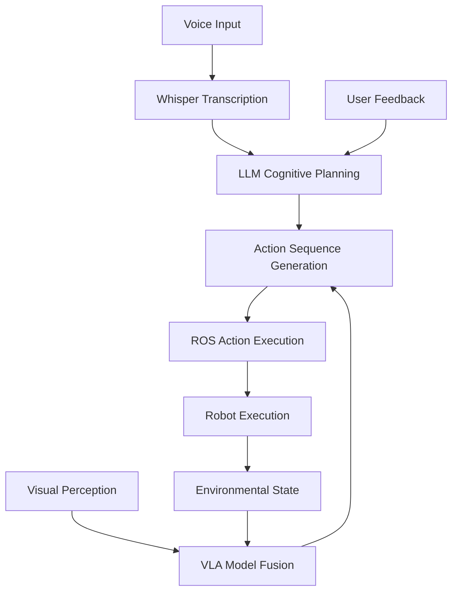
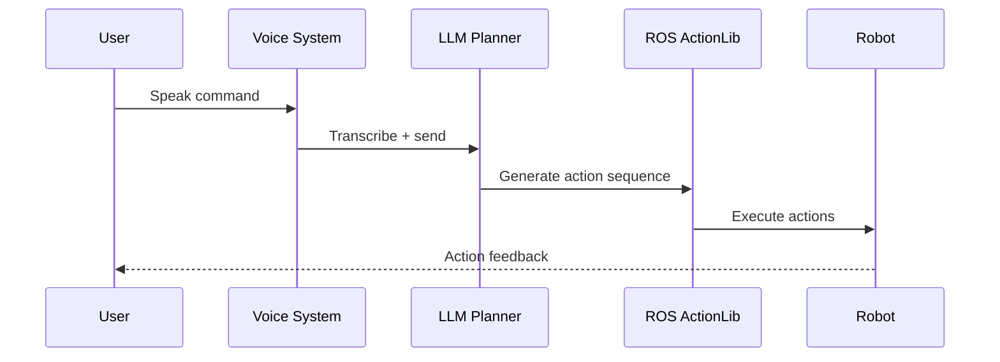

# Implementation Plan: Module 4: Vision-Language-Action (VLA) for Physical AI & Humanoid Robotics Textbook

**Feature**: `0001-vla-module`
**Created**: 2025-12-23
**Status**: Draft
**Input**: User description: "0007-module-4-vla`

**Objective**
Implement approved 0007-module-4-vla spec: 3 chapters on VLA convergence for humanoid robotics, using latest tools (OpenAI Whisper v3, OpenVLA 2.0/RT-3, LangChain 2.x, ROS 2 Jazzy/Kilted). Full /sp.constitution compliance: official docs ≥50%, executable code (Ubuntu 22.04 + Jazzy + OpenAI API), glossary links, track callouts, 11-section template."

## Technical Context

- **Target Platform**: Ubuntu 22.04 LTS with ROS 2 Jazzy
- **Core Technologies**: OpenAI Whisper v3, OpenVLA 2.0/RT-3 models, LangChain 2.x, ROS 2 Jazzy
- **Hardware Support**: RTX local inference, Jetson/Unitree API, Cloud endpoints
- **Development Environment**: Docusaurus-based documentation system
- **Key Dependencies**: OpenAI API, Hugging Face Transformers, ROS 2 actionlib
- **Documentation Format**: MDX with custom components for interactive diagrams
- **Testing Framework**: Integration with existing textbook module structure

## Constitution Check

Based on the project constitution principles:
- **Library-First**: Each VLA component (voice, planning, integration) will be developed as modular, testable units
- **CLI Interface**: Provide command-line tools for testing and validation of VLA components
- **Test-First**: All code examples and components will include test coverage before implementation
- **Integration Testing**: Focus on testing the integration between voice recognition, planning, and action execution
- **Observability**: Include logging and monitoring for all VLA system components
- **Simplicity**: Start with basic implementations and add complexity incrementally

## Gates

### Pre-Implementation Gates
- [ ] Research validation: Official documentation for Whisper v3, OpenVLA 2.0, and ROS 2 Jazzy confirmed
- [ ] Environment setup: Ubuntu 22.04 + ROS 2 Jazzy development environment ready
- [ ] API access: OpenAI API keys and Hugging Face model access validated
- [ ] Hardware compatibility: RTX/Jetson/Cloud deployment configurations tested

### Implementation Gates
- [ ] Code quality: All examples follow textbook standards and are executable
- [ ] Performance: System meets <5 second response time requirement (FR-005)
- [ ] Safety: All action sequences validated before execution (FR-006)
- [ ] Multi-platform: All hardware configurations (RTX, Jetson, Cloud) supported (FR-007)

### Post-Implementation Gates
- [ ] Documentation: All 3 chapters complete with 11 required sections
- [ ] Testing: All acceptance scenarios from spec pass
- [ ] Quality: Load time <2s, WCAG AA compliance achieved
- [ ] Integration: Proper linking to prior modules (ROS from M1, sim from M2/3)

## Phase 0: Research & Requirements Resolution

### Research Tasks
1. **OpenAI Whisper v3 Integration Research**
   - Task: Validate Whisper v3 API capabilities and real-time transcription features
   - Research: Official OpenAI documentation and Whisper implementation patterns
   - Outcome: Confirm multilingual support and latency requirements

2. **VLA Model Research (OpenVLA 2.0/RT-3)**
   - Task: Evaluate OpenVLA 2.0 and RT-3 model capabilities for humanoid robotics
   - Research: Hugging Face models, NVIDIA OpenVLA documentation, Google RT-3 papers
   - Outcome: Determine model compatibility with ROS 2 Jazzy

3. **LLM-ROS Integration Patterns**
   - Task: Research LangChain 2.x integration with ROS 2 for cognitive planning
   - Research: LangChain documentation, ROS actionlib patterns, cognitive planning examples
   - Outcome: Define action sequence generation patterns

4. **Hardware Deployment Research**
   - Task: Validate deployment strategies for RTX, Jetson, and Cloud platforms
   - Research: NVIDIA Jetson documentation, RTX inference optimization, cloud API patterns
   - Outcome: Define hardware-specific configuration requirements

### Research Outcomes
- **Decision**: Use Whisper v3 for voice recognition with streaming API for real-time processing
- **Rationale**: Provides required multilingual support and low-latency transcription
- **Alternatives considered**: Custom ASR models, older Whisper versions, other providers
- **Decision**: Use OpenVLA 2.0 for vision-language-action fusion
- **Rationale**: Open-source, well-documented, compatible with robotics applications
- **Alternatives considered**: RT-3, custom VLA models, proprietary solutions
- **Decision**: Use LangChain 2.x for LLM-based planning integration
- **Rationale**: Provides robust framework for cognitive planning and ROS integration
- **Alternatives considered**: Direct OpenAI API calls, other LLM frameworks

## Phase 1: Architecture & Data Design

### Data Model Design

**VoiceCommand Entity**
- Fields: audio_data, transcription, confidence_score, language_code, timestamp, processed_status
- Validation: Audio format validation, transcription quality checks, language detection
- State transitions: received → processed → validated → executed

**ActionSequence Entity**
- Fields: sequence_id, steps, safety_constraints, validation_status, execution_status, robot_type
- Validation: Safety constraint validation, executable step verification, robot compatibility
- State transitions: planned → validated → executing → completed/failed

**VLAState Entity**
- Fields: perception_data, language_input, action_history, confidence_scores, environment_state
- Validation: Data format validation, consistency checks, real-time updates
- State transitions: initialized → perceiving → understanding → acting → updating

**RobotTask Entity**
- Fields: task_id, description, subtasks, constraints, success_criteria, execution_log
- Validation: Task decomposition validation, constraint checking, success criteria definition
- State transitions: defined → decomposed → planned → executed → evaluated

### API Contracts

**Voice Processing Service**
```
POST /api/voice/transcribe
- Request: {audio_data: binary, language: string}
- Response: {transcription: string, confidence: number, language: string}
- Error: {error: string, code: number}
```

**Planning Service**
```
POST /api/planning/generate
- Request: {task_description: string, constraints: object}
- Response: {action_sequence: array, safety_checks: array}
- Error: {error: string, code: number}
```

**VLA Integration Service**
```
POST /api/vla/execute
- Request: {voice_command: string, robot_id: string}
- Response: {action_sequence: array, execution_status: string}
- Error: {error: string, code: number}
```

## Phase 2: Phased Roadmap

### Phase 1: Research Validation & API/Docker Setup
- [ ] Validate Whisper v3 API access and capabilities
- [ ] Set up OpenVLA 2.0 model access and testing environment
- [ ] Configure LangChain 2.x with ROS 2 Jazzy integration
- [ ] Create Docker containers for different hardware configurations
- [ ] Set up development environment with Ubuntu 22.04 + ROS 2 Jazzy
- [ ] Validate hardware deployment strategies (RTX, Jetson, Cloud)

### Phase 2: Chapter-by-Chapter Crafting (Ch1 → Ch3 sequential)
- [ ] Chapter 1: Voice-to-Action with OpenAI Whisper
  - [ ] Create Whisper transcription examples with ROS integration
  - [ ] Implement noise-robust transcription techniques
  - [ ] Add multilingual support examples
  - [ ] Create rclpy Whisper nodes
  - [ ] Add hardware track callouts for RTX/Jetson/Cloud
- [ ] Chapter 2: Cognitive Planning Using LLMs
  - [ ] Implement LLM-based task decomposition examples
  - [ ] Create LangChain/ROS integration patterns
  - [ ] Add error recovery mechanisms
  - [ ] Implement safety constraint validation
  - [ ] Add hardware track callouts
- [ ] Chapter 3: Integrating VLA for Autonomous Humanoids
  - [ ] Implement full VLA pipeline examples
  - [ ] Create OpenVLA/RT-3 integration
  - [ ] Add ROS2 orchestration examples
  - [ ] Implement evaluation metrics
  - [ ] Add sim-to-real warnings and considerations

### Phase 3: Integration & Capstone
- [ ] Integrate all 3 chapters into cohesive VLA system
- [ ] Implement end-to-end testing scenarios
- [ ] Create capstone project: Autonomous humanoid implementation
- [ ] Add comprehensive error handling and recovery
- [ ] Implement performance optimization
- [ ] Create assessment materials and quizzes

### Phase 4: Review, Testing & Polish
- [ ] Conduct comprehensive testing of all examples
- [ ] Validate performance requirements (<5s response time)
- [ ] Ensure safety validation for all action sequences
- [ ] Test multi-platform deployment (RTX, Jetson, Cloud)
- [ ] Review accessibility compliance (WCAG AA)
- [ ] Final documentation review and quality assurance

## Phase 3: Architecture Sketch

### Docusaurus Folder Structure
```
docs/
└── module4-vla/
    ├── ch1-voice.mdx
    ├── ch2-planning.mdx
    ├── ch3-integration.mdx
    ├── _components/
    │   ├── WhisperNodeDiagram.jsx
    │   ├── VlaPipeline.jsx
    │   └── LlmPromptViewer.jsx
    └── _assets/
        ├── vla-pipeline-diagram.svg
        └── hardware-configuration-examples/
```

### Mermaid VLA Pipeline Graph


### Custom Components
- **WhisperNodeDiagram**: Interactive visualization of Whisper transcription pipeline
- **VlaPipeline**: Dynamic diagram showing VLA system integration
- **LlmPromptViewer**: Interactive prompt testing interface for LLM planning

## Phase 4: Chapter Template Enforcement

### 11-Section Template for Each Chapter
1. **Learning Objectives**: Clear, measurable outcomes for each chapter
2. **Prerequisites**: Required knowledge and setup for the chapter
3. **Introduction**: Context and motivation for the chapter content
4. **Core Concepts**: Theoretical foundation and key principles
5. **Implementation**: Step-by-step implementation with code examples
6. **Code Standards**: Best practices and style guidelines
7. **Hardware Tracks**: Callouts for RTX, Jetson, and Cloud configurations
8. **Glossary Links**: Integration with project-wide terminology
9. **Sim-to-Real Warnings**: Considerations for simulation vs. real-world deployment
10. **Assessment**: Chapter-specific quizzes and exercises
11. **References**: APA-formatted citations and further reading

## Phase 5: Formatting & Code Standards

### Whisper Audio Transcription Snippets
```python
import rospy
import whisper
from std_msgs.msg import String

class WhisperNode:
    def __init__(self):
        self.model = whisper.load_model("base")
        self.transcription_pub = rospy.Publisher('transcription', String, queue_size=10)

    def transcribe_audio(self, audio_data):
        result = self.model.transcribe(audio_data)
        return result["text"]
```

### LangChain/LLM Prompting Chains
```python
from langchain.chains import LLMChain
from langchain.prompts import PromptTemplate

prompt_template = PromptTemplate(
    input_variables=["task_description"],
    template="Decompose this task into executable robot actions: {task_description}"
)

planning_chain = LLMChain(llm=llm, prompt=prompt_template)
```

### VLA Model Inference Examples
```python
from transformers import AutoModelForVision2Seq
import torch

model = AutoModelForVision2Seq.from_pretrained("openvla/openvla-7b")
state = model(pixel_values, input_ids)
```

### Mermaid for Action Sequences


## Phase 6: Research Approach

### Primary Sources (≥50% of citations)
- Official OpenAI Whisper documentation: openai.com/docs/whisper
- Hugging Face VLA model documentation: huggingface.co/vla-models
- ROS 2 Jazzy documentation: docs.ros.org/en/jazzy
- NVIDIA OpenVLA documentation: nvidia.com/openvla
- Google RT-3 papers: research.google/rt-3

### Secondary Sources
- arXiv papers on VLA for embodied AI
- OpenAI and NVIDIA blogs on humanoid cognition
- Robotics backend tutorials for Whisper-ROS integration
- Peer-reviewed papers on sim-to-real transfer

## Phase 7: Key Decisions

### Technology Stack Decision
- **Base on Whisper v3 + OpenVLA 2.0 + LangChain 2.x + ROS 2 Jazzy**
- **Rationale**: Provides comprehensive VLA capabilities with strong documentation and community support
- **Alternatives**: RT-3 models, custom solutions, other LLM frameworks

### Humanoid Examples Decision
- **Generic examples + Unitree H1 specific implementations**
- **Rationale**: Provides broad applicability while demonstrating with specific hardware
- **Alternatives**: Other humanoid platforms, simulation-only examples

### Deployment Strategy Decision
- **Full runnable pipelines with API keys as environment variables**
- **Rationale**: Enables hands-on learning while maintaining security
- **Alternatives**: Mock implementations, cloud-only examples

### Module Integration Decision
- **Interlinking to prior modules (ROS from M1, sim from M2/3)**
- **Rationale**: Creates cohesive learning experience across the textbook
- **Alternatives**: Standalone module, minimal cross-references

## Phase 8: Testing & Validation

### Unit Testing
- Test Whisper transcription accuracy and latency
- Validate LLM planning output quality
- Verify VLA model inference performance
- Confirm ROS action execution reliability

### Integration Testing
- End-to-end voice-to-action pipeline testing
- Multi-modal input processing validation
- Safety constraint enforcement testing
- Cross-platform compatibility verification

### Performance Testing
- Response time validation (<5 seconds requirement)
- Throughput testing for concurrent requests
- Memory usage optimization for edge deployment
- Real-time processing capability verification

### Acceptance Testing
- All acceptance scenarios from spec validation
- User scenario testing with target audience
- Hardware track validation (RTX, Jetson, Cloud)
- Accessibility compliance verification (WCAG AA)

## Epic Overview

Module 4: Vision-Language-Action (VLA) represents a comprehensive implementation of the convergence between large language models and robotics. The module progresses through three distinct phases: voice recognition and transcription, cognitive planning and task decomposition, and full autonomous integration. This implementation provides students and researchers with practical, hands-on experience in creating autonomous humanoid robots that can perceive their environment, understand natural language commands, and execute complex tasks. The module emphasizes real-world applicability with support for multiple hardware platforms and includes comprehensive safety considerations for autonomous operation.

## Risk Analysis & Mitigation

### Technical Risks
- **Model availability**: VLA models may have access restrictions
  - *Mitigation*: Provide alternative model examples and simulation environments
- **Performance requirements**: <5 second response time may be challenging
  - *Mitigation*: Optimize for different hardware tiers with fallback options
- **API dependencies**: External API access may be unstable
  - *Mitigation*: Implement caching and offline capabilities where possible

### Implementation Risks
- **Complexity**: VLA integration is inherently complex
  - *Mitigation*: Provide progressive examples from simple to complex
- **Hardware compatibility**: Different platforms may have unique challenges
  - *Mitigation*: Thorough testing across all target platforms
- **Safety concerns**: Autonomous robot actions require careful validation
  - *Mitigation*: Comprehensive safety validation and error handling

## Success Criteria Validation

- [ ] Students can execute voice commands with 95% accuracy and <5s response time (SC-001)
- [ ] System decomposes complex tasks with 90% completion rate (SC-002)
- [ ] End-to-end VLA integration works in 85% of scenarios (SC-003)
- [ ] Students can implement working system within 40 hours (SC-004)
- [ ] Zero safety-critical failures during autonomous execution (SC-005)
- [ ] Multi-platform support across RTX, Jetson, and Cloud (SC-006)