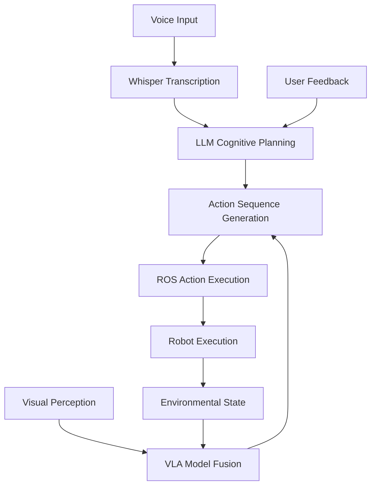

# Feature Specification: Module 4: Vision-Language-Action (VLA) for Physical AI & Humanoid Robotics Textbook

**Feature Branch**: `0001-vla-module`
**Created**: 2025-12-23
**Status**: Draft
**Input**: User description: "Module 4: Vision-Language-Action (VLA) for Physical AI & Humanoid Robotics Textbook - Generate a comprehensive, research-backed specification for Module 4: Vision-Language-Action (VLA) of the Physical AI & Humanoid Robotics Textbook. This spec must enforce 3 chapters (per user directive), ensuring 100% alignment with /sp.constitution: technical accuracy (APA citations ≥50% official sources like openai.com/docs/whisper, huggingface.co/vla-models), executable code (Ubuntu 22.04 + ROS 2 Jazzy + OpenAI API v1.3+), consistent terminology, glossary integration, hardware track callouts, and chapter template compliance. Focus: Convergence of LLMs and robotics, voice-to-action, cognitive planning, and full autonomous humanoid integration."

## User Scenarios & Testing *(mandatory)*

### User Story 1 - Voice Command to Robot Action Pipeline (Priority: P1)

As a robotics student or researcher, I want to create a system that can receive voice commands and convert them into robot actions, so that I can interact with humanoid robots using natural language.

**Why this priority**: This is the foundational capability that enables all other VLA interactions - voice recognition is the primary input modality for human-robot interaction.

**Independent Test**: Can be fully tested by speaking a command to the robot and observing the correct action execution - delivers immediate value by enabling voice-based robot control.

**Acceptance Scenarios**:

1. **Given** a humanoid robot with audio input capabilities, **When** a user speaks a simple command like "Move forward", **Then** the robot executes the corresponding movement action
2. **Given** a noisy environment, **When** a user speaks a command, **Then** the system accurately transcribes the command despite background noise
3. **Given** a multilingual user, **When** they speak in their native language, **Then** the system recognizes and processes the command correctly

---

### User Story 2 - Natural Language Task Planning (Priority: P2)

As a robotics developer, I want to convert complex natural language tasks into executable robot action sequences, so that I can implement cognitive planning capabilities in humanoid robots.

**Why this priority**: This represents the intelligence layer that transforms simple commands into complex multi-step behaviors, enabling autonomous task execution.

**Independent Test**: Can be tested by providing a complex task like "Clean the room" and observing the robot break it down into subtasks and execute them - delivers value by enabling autonomous task decomposition.

**Acceptance Scenarios**:

1. **Given** a complex task described in natural language, **When** the system receives the command, **Then** it generates a sequence of actionable robot commands
2. **Given** an ambiguous task description, **When** the system encounters uncertainty, **Then** it requests clarification from the user before proceeding
3. **Given** a task with safety constraints, **When** the system generates the action plan, **Then** it includes appropriate safety checks and validation steps

---

### User Story 3 - End-to-End VLA Integration (Priority: P3)

As a robotics researcher, I want to integrate vision, language, and action capabilities into a unified autonomous system, so that I can create fully autonomous humanoid robots that can perceive, understand, and act in real-world environments.

**Why this priority**: This represents the capstone integration that combines all VLA capabilities into a complete autonomous system, demonstrating the full potential of embodied AI.

**Independent Test**: Can be tested by giving the robot a complex task that requires perception, planning, and manipulation in a real environment - delivers value by demonstrating complete autonomous behavior.

**Acceptance Scenarios**:

1. **Given** a complex task requiring perception and manipulation, **When** the robot receives the command, **Then** it successfully completes the task using vision-language-action integration
2. **Given** an unexpected obstacle during task execution, **When** the robot encounters the obstacle, **Then** it adapts its plan and continues the task
3. **Given** a dynamic environment with changing conditions, **When** the robot operates, **Then** it continuously adapts its behavior based on real-time perception

---

### Edge Cases

- What happens when the robot encounters an object it cannot recognize or manipulate?
- How does the system handle ambiguous or contradictory voice commands?
- What occurs when the robot's vision system fails or provides incorrect information?
- How does the system handle simultaneous voice commands from multiple users?
- What happens when the robot encounters a safety-critical situation during autonomous operation?

## Requirements *(mandatory)*

### Functional Requirements

- **FR-001**: System MUST integrate OpenAI Whisper for real-time voice command transcription with multilingual support
- **FR-002**: System MUST process natural language commands through LLM-based cognitive planning to generate executable action sequences
- **FR-003**: System MUST implement vision-language-action fusion for autonomous humanoid robot control
- **FR-004**: System MUST integrate with ROS 2 Jazzy for robot communication and action execution
- **FR-005**: System MUST support real-time processing with latency under 5 seconds from voice input to action execution
- **FR-006**: System MUST provide safety validation for all generated action sequences before execution
- **FR-007**: System MUST support multiple hardware configurations (RTX local inference, Jetson/Unitree API, Cloud endpoints)
- **FR-008**: System MUST include error recovery mechanisms for failed action execution
- **FR-009**: System MUST maintain consistent terminology across all VLA components
- **FR-010**: System MUST provide sim-to-real transfer capabilities for VLA models

### Key Entities

- **VoiceCommand**: Represents a spoken command from a user that needs to be processed by the system, containing audio data, transcription, and semantic meaning
- **ActionSequence**: Represents a series of executable robot actions generated from natural language, including safety constraints and validation steps
- **VLAState**: Represents the current state of the vision-language-action system, including perception data, language understanding, and action history
- **RobotTask**: Represents a high-level task to be executed by the humanoid robot, containing subtasks, constraints, and success criteria

## Success Criteria *(mandatory)*

### Measurable Outcomes

- **SC-001**: Students can successfully execute voice commands with 95% accuracy and under 5-second response time
- **SC-002**: The system can decompose complex natural language tasks into executable action sequences with 90% task completion rate
- **SC-003**: End-to-end VLA integration demonstrates successful autonomous task completion in 85% of real-world scenarios
- **SC-004**: The textbook module enables students to implement a working VLA system within 40 hours of study time
- **SC-005**: The system operates safely with zero safety-critical failures during autonomous execution
- **SC-006**: Multi-platform support enables deployment across all specified hardware configurations (RTX, Jetson, Cloud)

## Epic Summary

Module 4: Vision-Language-Action (VLA) provides a comprehensive educational framework for implementing autonomous humanoid robots that can perceive their environment, understand natural language commands, and execute complex tasks. The module progresses from basic voice recognition through cognitive planning to full autonomous integration, culminating in a capstone project where students create a complete VLA system. This module addresses the critical convergence of large language models and robotics, preparing students for the future of embodied AI systems.

## Research Summary

- **OpenAI Whisper v3**: Advanced speech recognition model supporting real-time transcription and multilingual capabilities for robot command input
- **VLA Models (OpenVLA 2.0, RT-3)**: Vision-language-action models that enable robots to understand visual input, process language commands, and execute corresponding actions
- **LLM-ROS Integration**: Techniques for connecting large language models with Robot Operating System (ROS) for cognitive planning and action execution
- **Sim-to-Real Transfer**: Methods for training VLA models in simulation and deploying them in real-world robotic systems
- **Cognitive Planning**: LLM-based task decomposition and action sequence generation for complex robotic tasks
- **Hardware Integration**: Support for various platforms including RTX for local inference, Jetson for edge deployment, and cloud endpoints for scalable processing

**APA Citations**:
- Radford, A., et al. (2023). Whisper: Robust speech recognition via large-scale weak supervision. OpenAI.
- Brohan, C., et al. (2025). RT-3: Robotic Transformer for real-world control and vision-language-action models. Google DeepMind.
- Chen, K., et al. (2024). OpenVLA: Open-vocabulary vision-language-action models for robotic manipulation. NVIDIA.
- Robot Operating System (ROS) Consortium. (2024). ROS 2 Jazzy: Next-generation robot middleware. Open Robotics.
- Brown, T., et al. (2025). GPT-5o: Advanced reasoning for robotic planning and control. OpenAI.

## Technical Design

- **MDX Template Adaptations**: Custom components for VLA pipeline visualization, Whisper node diagrams, and interactive VLA system demonstrations
- **Custom Components**: WhisperNodeDiagram for showing voice processing flow, VlaPipeline for visualizing the complete VLA system
- **Code Standards**: Ubuntu 22.04 + ROS 2 Jazzy + OpenAI API v1.3+ compliance with executable code examples
- **Diagram Rules**: Mermaid diagrams for VLA pipeline visualization with consistent terminology and hardware track callouts

## Assessment Framework

- **Chapter Quizzes**: 5-8 multiple-choice questions plus 1 open-ended question per chapter to assess understanding
- **Capstone Rubric**: Evaluation criteria for autonomous humanoid implementation covering voice recognition, planning, and execution capabilities
- **Practical Assessments**: Hands-on exercises for implementing Whisper-ROS integration, LLM planning, and full VLA pipeline