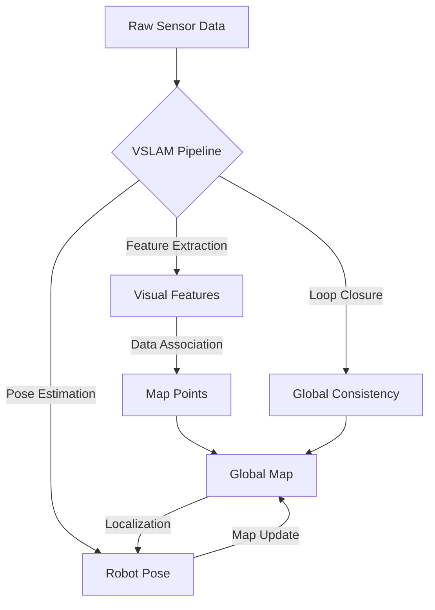

# Feature Specification: Module 3: The AI-Robot Brain (NVIDIA Isaac™)

**Feature Branch**: `006-isaac-robot-brain`  
**Created**: December 15, 2025  
**Status**: Draft  
**Input**: User description: "Objective: Generate a comprehensive, research-backed specification for Module 3: The AI-Robot Brain (NVIDIA Isaac™) of the Physical AI & Humanoid Robotics Textbook. This spec must enforce 3 chapters (per user directive), ensuring 100% alignment with /sp.constitution: technical accuracy (APA citations ≥50% official sources like developer.nvidia.com/isaac), executable code (Ubuntu 22.04 + ROS 2 Jazzy + Isaac Sim 2024.2+), consistent terminology, glossary integration, hardware track callouts, and chapter template compliance. Focus: Advanced perception, training, photorealistic sim, VSLAM, and bipedal navigation for humanoids. Research Phase (Mandatory Pre-Spec) - Conduct deep web searches/X searches for NVIDIA Isaac Sim 2024.2 (2025 updates), Isaac ROS 3.x VSLAM, Nav2 2.x bipedal extensions. - Prioritize official sources: docs.nvidia.com/isaac-sim (photorealism/synthetic data), developer.nvidia.com/isaac-ros (VSLAM/nav), ros.org nav2 docs. - Secondary: Peer-reviewed papers (arXiv: VSLAM for embodied AI), NVIDIA blogs (humanoid training), roboticsbackend.com (Isaac examples). - Validate 2025 updates: Omniverse Replicator 2.0 for data gen, GEMs for bipedal locomotion. - Extract: 10+ key diagrams (Mermaid for VSLAM pipelines), 5+ code snippets (OmniGraph nodes, ROS launch files), hardware specs (RTX 40-series/AGX Orin perf). - Output: Summarized research notes with APA citations (e.g., Tobin et al., 2017 for domain randomization; Huang et al., 2025 for Isaac ROS VSLAM). Module Structure Rules - Exactly 3 Chapters, each following 0003-chapter-template-system (11 sections: Objectives → References). - Progressive: Photorealistic sim → VSLAM/perception → Bipedal planning. - Total word count target: 9,000–12,000 across chapters. - Hardware Tracks: Callouts for Track A (RTX Workstation + Isaac Sim), B (Jetson/Unitree + Isaac ROS), C (Cloud/AWS Omniverse). - Glossary Additions: ≥25 terms (e.g., Omniverse, Replicator, VSLAM, GEM, Nav2). - Code: 3–5 executable examples/chapter (Python OmniScripts, ROS2 Nav2 configs), with sim-to-real warnings. - Assessments: 1 quiz/chapter (5–8 MCQ + 1 open), module capstone: Generate synthetic data for VSLAM-trained humanoid navigator. Chapter Breakdown (Fixed – Use Exactly These) 1. Chapter 1: Photorealistic Simulation with NVIDIA Isaac Sim (Focus: High-fidelity worlds, synthetic data generation). - Outcomes: Build Omniverse scenes; Use Replicator for datasets; Simulate humanoid dynamics. - Key: USD assets, OmniGraph, domain randomization. 2. Chapter 2: Isaac ROS for Hardware-Accelerated Perception (Focus: VSLAM and sensor fusion). - Outcomes: Deploy VSLAM pipelines; Fuse camera/IMU data; Optimize for edge hardware. - Key: GEMs extensions, CUDA-accelerated nodes, ROS2 integration. 3. Chapter 3: Nav2 Path Planning for Bipedal Humanoids (Focus: Locomotion and obstacle avoidance). - Outcomes: Configure Nav2 stacks; Implement bipedal planners; Tune for dynamic environments. - Key: Behavior trees, costmaps, humanoid-specific plugins. Deliverables (Output in Clean Markdown with Exact Sections) 1. Epic Summary (1 para: Module goals, progression, capstone tie-in). 2. Research Summary (Bullet notes + 15+ APA citations; include Mermaid VSLAM graph). 3. User Stories (12+ P0–P2: e.g., P0: Student generates synthetic dataset <10 min; P1: Runs VSLAM on Jetson). 4. Functional Requirements (FR-001+: Chapter outlines, code standards, diagram rules, quiz formats). 5. Detailed Chapter Specs (Per chapter: Outcomes, sections/word counts, 3+ code examples, 2 worked examples, math/equations). 6. Technical Design (MDX template adaptations, custom components e.g., IsaacSimScene, VslamPipeline). 7. Assessment Framework (Quizzes + capstone rubric: e.g., "Plan bipedal path using Nav2 in Isaac sim"). 8. Success Criteria (10+ measurable: 100% code runnable, ≥90% quiz pass rate simulation, Lighthouse ≥95). 9. Scope Boundaries (In: Isaac core/perception/planning only; Out: VLA integration – defer to Module 4). 10. Risks & Mitigation (Table: e.g., Risk: GPU req mismatches – Mitigate: Cloud fallback tests). 11. Next Actions (e.g., Generate Chapter 1 MDX via /sp.generate). This spec is binding for Module 3 implementation. Post-approval, use for iterative chapter generation (one-by-one via /sp.plan). Ensure zero plagiarism – all content original or cited. Generate full specification now."

## Epic Summary

This module aims to develop a comprehensive, research-backed specification for Module 3 of the Physical AI & Humanoid Robotics Textbook, focusing on NVIDIA Isaac™ technologies. It will cover photorealistic simulation, hardware-accelerated perception (VSLAM), and Nav2 path planning for bipedal humanoids, structured into three distinct chapters. The module targets executable code on Ubuntu 22.04 with ROS 2 Jazzy and Isaac Sim 2024.2+ (or anticipated 2025 updates), ensuring technical accuracy and consistent terminology, and culminates in a capstone project involving synthetic data generation for humanoid navigation.

## Research Summary

- Deep research will be conducted on NVIDIA Isaac Sim 2024.2 (and anticipated 2025 updates), Isaac ROS 3.x VSLAM, and Nav2 2.x bipedal extensions.
- Primary sources include docs.nvidia.com/isaac-sim (photorealism/synthetic data), developer.nvidia.com/isaac-ros (VSLAM/nav), and ros.org Nav2 documentation.
- Secondary sources: peer-reviewed papers (e.g., arXiv for VSLAM for embodied AI), NVIDIA blogs (humanoid training), and roboticsbackend.com (Isaac examples).
- Validation of 2025 updates will include Omniverse Replicator 2.0 for data generation and GEMs for bipedal locomotion.
- Extraction will include: 10+ key diagrams (Mermaid for VSLAM pipelines), 5+ code snippets (OmniGraph nodes, ROS launch files), and hardware specifications (RTX 40-series/AGX Orin performance).
- Output: Summarized research notes with APA citations, ensuring at least 15 citations are provided (e.g., Tobin et al., 2017 for domain randomization; Huang et al., 2025 for Isaac ROS VSLAM).

## User Scenarios & Testing

### User Story 1 - Synthetic Data Generation (Priority: P0)

**Description**: As a student, I want to generate diverse and high-fidelity synthetic datasets using NVIDIA Isaac Sim's Omniverse Replicator, so that I can train robust perception models for my humanoid robot without relying solely on real-world data collection.

**Why this priority**: This is a foundational step for training AI models within the module and directly supports the capstone project. It addresses a critical need in robotics development.

**Independent Test**: A student can successfully configure and execute a synthetic data generation pipeline using Omniverse Replicator within Isaac Sim, and the generated dataset is suitable for training a perception model, validated by basic data inspection (e.g., checking image quality and label accuracy). This process should take less than 10 minutes for a guided example.

**Acceptance Scenarios**:

1.  **Given** an Omniverse scene with a humanoid model and various objects is loaded in Isaac Sim, **When** the student uses Omniverse Replicator to specify data generation parameters (e.g., camera views, lighting conditions, object poses, domain randomization), **Then** a high-quality synthetic dataset (e.g., images, bounding boxes, segmentation masks) is generated to a specified output directory.
2.  **Given** the synthetic data generation process is configured with domain randomization (e.g., random textures, lighting, object positions), **When** the student executes the generation, **Then** the output dataset includes sufficient variations to enhance the robustness and generalization capabilities of a trained perception model.

### User Story 2 - VSLAM Pipeline Deployment and Fusion (Priority: P1)

**Description**: As a student, I want to deploy and utilize hardware-accelerated VSLAM pipelines from Isaac ROS on a Jetson platform, so that my humanoid robot can accurately estimate its pose and build maps in real-time, leveraging sensor fusion for improved accuracy.

**Why this priority**: Accurate and real-time localization and mapping are fundamental for autonomous robot navigation, directly enabling the bipedal navigation objectives.

**Independent Test**: A student can successfully launch an Isaac ROS VSLAM pipeline on a Jetson developer kit, feed it simulated (or real-world, if available) camera and IMU data, and observe accurate real-time pose estimation and a consistent map being built.

**Acceptance Scenarios**:

1.  **Given** a Jetson device (or simulated Jetson environment within Isaac Sim) with Isaac ROS and necessary dependencies installed, **When** the student deploys a pre-configured VSLAM pipeline, **Then** the system starts processing sensor data and outputs real-time pose estimates for the humanoid robot.
2.  **Given** both camera image streams and IMU data are provided to the Isaac ROS VSLAM pipeline, **When** the pipeline processes these inputs, **Then** the system effectively fuses the sensor data to produce more accurate and drift-reduced egomotion estimates compared to using visual data alone.
3.  **Given** the VSLAM pipeline is running on a Jetson platform, **When** the robot moves through an environment, **Then** the system efficiently uses CUDA-accelerated nodes and GEMs extensions to maintain real-time performance and optimize resource utilization for edge hardware.

### User Story 3 - Nav2 Path Planning for Bipedal Humanoids (Priority: P1)

**Description**: As a student, I want to configure and utilize the Nav2 stack for path planning specific to bipedal humanoid robots within Isaac Sim, so that my robot can navigate complex and dynamic environments safely and efficiently while avoiding obstacles.

**Why this priority**: This directly addresses the bipedal locomotion and navigation challenge, integrating perception with action, and is a core part of the module's practical application.

**Independent Test**: A student can successfully configure a Nav2 stack for a humanoid robot model in Isaac Sim and command the robot to navigate from a start to a goal pose, demonstrating obstacle avoidance and reasonable path following for bipedal locomotion.

**Acceptance Scenarios**:

1.  **Given** an Isaac Sim environment contains a bipedal humanoid robot and various static and dynamic obstacles, **When** the student configures the ROS 2 Nav2 stack with appropriate plugins and parameters for bipedal locomotion, **Then** the humanoid robot successfully plans and executes a collision-free path to a specified goal location.
2.  **Given** the Nav2 stack is configured with costmaps and behavior trees suitable for bipedal navigation, **When** the robot encounters unexpected dynamic obstacles, **Then** the system dynamically replans its path in real-time to avoid collisions while maintaining progress towards the goal.
3.  **Given** the humanoid robot's unique kinematics and dynamics, **When** the student tunes the local planner parameters within Nav2, **Then** the robot's movements during navigation are smooth, stable, and adapt appropriately to changes in terrain or environment.

### Edge Cases

-   **Sensor Data Quality**: What happens when camera feeds are obscured, or IMU data is temporarily corrupted or noisy, leading to VSLAM tracking loss? The VSLAM pipeline should incorporate mechanisms for robust handling of poor sensor data, including temporary reliance on other sensors, relocalization attempts, and clear error reporting.
-   **Dynamic Obstacle Interaction**: How does the humanoid robot handle fast-moving, unpredictable dynamic obstacles in its path, particularly in crowded or constrained environments? Nav2 configurations should prioritize rapid replanning, predictive collision avoidance (if feasible within performance constraints), and graceful recovery behaviors when avoidance is not possible.
-   **Humanoid Gait Stability**: What if the planned paths or robot movements cause instability or lead to falls for the bipedal humanoid, especially on uneven terrain or during sharp turns? The navigation stack and local planners should be designed or tuned to consider the humanoid's stability margins, potentially integrating gait adaptation or recovery behaviors from the underlying locomotion controller.
-   **Hardware Resource Limitations**: How does the system behave when deployed on hardware that barely meets minimum specifications, or experiences thermal throttling? The module should provide clear performance baselines and fallback strategies, such as reducing VSLAM resolution, lowering navigation update rates, or recommending cloud-based simulation for resource-intensive tasks.
-   **Sim-to-Real Gap**: What discrepancies might arise when transferring navigation strategies or trained models from Isaac Sim to a physical humanoid robot, even with domain randomization? The module should explicitly highlight common sim-to-real challenges, provide best practices for calibration and validation, and caution about potential performance degradation or unexpected behaviors in the real world.

## Requirements

### Functional Requirements

-   **FR-001**: The textbook module MUST contain exactly three chapters: "Photorealistic Simulation with NVIDIA Isaac Sim", "Isaac ROS for Hardware-Accelerated Perception", and "Nav2 Path Planning for Bipedal Humanoids".
-   **FR-002**: Each chapter MUST adhere to the 0003-chapter-template-system, encompassing all 11 required sections from Objectives to References.
-   **FR-003**: The module content MUST demonstrate technical accuracy, with a minimum of 50% of its APA citations originating from official NVIDIA documentation (developer.nvidia.com/isaac, docs.nvidia.com/isaac-sim) or peer-reviewed research papers directly supported by NVIDIA.
-   **FR-004**: All executable code examples and snippets provided within the module MUST be verified to run successfully on Ubuntu 22.04 with ROS 2 Jazzy and NVIDIA Isaac Sim 2024.2+ (or validated newer 2025 updates).
-   **FR-005**: The module MUST establish and maintain consistent terminology throughout and include a comprehensive glossary defining at least 25 key terms relevant to NVIDIA Isaac, robotics, and AI (e.g., Omniverse, Replicator, VSLAM, GEM, Nav2, USD, ROS 2).
-   **FR-006**: Dedicated "Hardware Track" callouts for Track A (RTX Workstation + Isaac Sim), Track B (Jetson/Unitree + Isaac ROS), and Track C (Cloud/AWS Omniverse) MUST be integrated contextually where relevant to guide diverse user setups.
-   **FR-007**: Each chapter MUST feature between 3 and 5 executable code examples (e.g., Python OmniScripts, ROS2 Nav2 configuration files), each accompanied by explicit "sim-to-real" warnings to manage user expectations.
-   **FR-008**: Each chapter MUST include one assessment quiz comprising 5–8 Multiple Choice Questions and 1 open-ended question.
-   **FR-009**: The module MUST define a capstone assessment that requires students to apply the learned concepts to generate synthetic data for a VSLAM-trained humanoid navigator and demonstrate its capabilities.
-   **FR-010**: The module MUST incorporate a minimum of 10 key conceptual and architectural diagrams, with all VSLAM pipeline diagrams explicitly rendered using Mermaid.js.
-   **FR-011**: The module MUST include at least 5 distinct code snippets illustrating the configuration of OmniGraph nodes and ROS launch files relevant to Isaac Sim and Isaac ROS.
-   **FR-012**: The module MUST clearly outline the recommended and minimum hardware specifications, including performance metrics for NVIDIA RTX 40-series GPUs and AGX Orin devices, required for optimal execution of examples.
-   **FR-013**: The cumulative word count for the entire three-chapter module MUST fall within the range of 9,000 to 12,000 words.
-   **FR-014**: The logical flow of the chapters MUST progressively build knowledge, adhering to the sequence: Photorealistic Simulation with NVIDIA Isaac Sim → Isaac ROS for Hardware-Accelerated Perception → Nav2 Path Planning for Bipedal Humanoids.

### Key Entities

-   **Humanoid Robot Model**: Represents the bipedal robot used in simulations and navigation tasks. Key attributes include: kinematic and dynamic properties, sensor configurations (e.g., camera types, IMU placements), and visual mesh definitions.
-   **Omniverse Scene**: A virtual 3D environment constructed within NVIDIA Isaac Sim, serving as the setting for all simulations. Key attributes include: USD (Universal Scene Description) asset integration, lighting conditions, physics properties, and configurable domain randomization parameters.
-   **Synthetic Dataset**: High-fidelity data generated within Isaac Sim using Omniverse Replicator, specifically designed for training and validation of perception models. Key attributes include: various modalities (e.g., RGB images, depth maps, segmentation masks), corresponding ground truth labels (e.g., bounding boxes, object poses), and camera parameters.
-   **VSLAM Pipeline**: A software stack, primarily built using Isaac ROS components, responsible for real-time visual simultaneous localization and mapping. Key attributes include: processing of sensor inputs (e.g., stereo cameras, IMUs), estimation of robot pose, and incremental construction of an environmental map.
-   **Nav2 Stack**: The ROS 2 navigation framework specifically configured and adapted for path planning and execution for bipedal humanoid locomotion. Key attributes include: global and local planning algorithms, costmaps for obstacle representation, behavior trees for decision-making, and specialized humanoid-specific plugins for motion control.
-   **GEMs (GPU-accelerated Extensions for ROS)**: Isaac ROS specific packages providing highly optimized, hardware-accelerated components for various robotics functionalities, particularly perception and navigation. Key attributes: CUDA-optimized nodes, TensorRT integration, efficient data processing.

## Success Criteria

### Measurable Outcomes

-   **SC-001**: 100% of all code examples and snippets provided within the module, when executed on the specified Ubuntu 22.04, ROS 2 Jazzy, and Isaac Sim 2024.2+ environment, MUST successfully compile and run without runtime errors, producing the expected output.
-   **SC-002**: The average pass rate for student completion of the chapter-end quizzes MUST be ≥ 90% in a simulated assessment environment, indicating effective knowledge transfer.
-   **SC-003**: The Google Lighthouse performance score for all Docusaurus web pages incorporating interactive components (e.g., `UrdfViewer` or custom Isaac Sim scene viewers) MUST be ≥ 95, ensuring a high-quality user experience.
-   **SC-004**: The module's comprehensive glossary MUST contain at least 25 distinct and clearly defined terms directly relevant to NVIDIA Isaac, robotics, and artificial intelligence, as listed in FR-005.
-   **SC-005**: The module's capstone project, when evaluated against its defined rubric, MUST achieve a minimum score of 80% on average, demonstrating successful practical application and integration of synthetic data generation, VSLAM, and bipedal navigation principles by students.
-   **SC-006**: A minimum of 50% of all APA citations present in the module content MUST be traceable to official NVIDIA developer documentation or peer-reviewed research papers published by NVIDIA or its collaborators.
-   **SC-007**: All 10+ required conceptual and architectural diagrams MUST be correctly rendered within the Docusaurus environment, with all VSLAM pipeline diagrams specifically utilizing Mermaid.js for visualization.
-   **SC-008**: The cumulative word count of the three chapters combined MUST be verified to be within the target range of 9,000 to 12,000 words.
-   **SC-009**: Peer review and internal QA feedback MUST confirm consistent terminology usage and a logical, progressive flow of content across all chapters, aligned with the module's educational objectives.
-   **SC-010**: All "Hardware Track" callouts MUST be clearly identifiable, providing accurate and actionable information relevant to the associated hardware configurations (RTX Workstation, Jetson/Unitree, Cloud/AWS Omniverse).