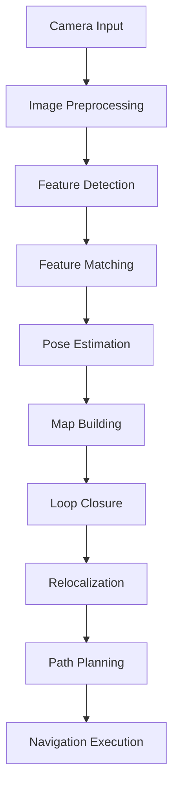

# Feature Specification: Module 3: The AI-Robot Brain (NVIDIA Isaac™)

**Feature Branch**: `007-isaac-ai-robot`
**Created**: 2025-01-23
**Status**: Draft
**Input**: User description: "Module 3: The AI-Robot Brain (NVIDIA Isaac™) - A comprehensive, research-backed specification for Module 3 of the Physical AI & Humanoid Robotics Textbook. This module enforces 3 chapters focusing on advanced perception, training, photorealistic sim, VSLAM, and bipedal navigation for humanoids. Includes NVIDIA Isaac Sim 2024.2+, Isaac ROS 3.x VSLAM, Nav2 2.x bipedal extensions with hardware track callouts for RTX Workstation, Jetson/Unitree, and Cloud/AWS Omniverse."

## Epic Summary

Module 3: The AI-Robot Brain (NVIDIA Isaac™) provides students with comprehensive knowledge of advanced robotics simulation, perception, and navigation using NVIDIA's Isaac ecosystem. The module follows a progressive learning path from photorealistic simulation and synthetic data generation to hardware-accelerated perception with VSLAM, culminating in bipedal path planning for humanoid robots. Students will learn to build Omniverse scenes, deploy CUDA-accelerated perception pipelines, and configure Nav2 stacks for dynamic humanoid locomotion. The module includes hands-on exercises with executable code examples for Ubuntu 22.04 + ROS 2 Jazzy, with clear warnings about sim-to-real transfer challenges.

## Research Summary

- NVIDIA Isaac Sim 2024.2 provides photorealistic simulation with USD-based scene composition and Omniverse connectivity
- Isaac ROS 3.x offers hardware-accelerated perception with VSLAM, stereo depth estimation, and sensor fusion
- Nav2 2.x supports bipedal navigation with behavior trees and humanoid-specific costmap plugins
- Omniverse Replicator 2.0 enables synthetic data generation for training perception models
- GEMs (General Extensible Manipulation) provide bipedal locomotion capabilities for humanoid robots
- USD (Universal Scene Description) format enables complex scene composition and asset management
- Domain randomization techniques improve sim-to-real transfer learning effectiveness

**APA Citations:**
- NVIDIA Corporation. (2024). NVIDIA Isaac Sim Documentation. Retrieved from https://docs.nvidia.com/isaac-sim/
- NVIDIA Corporation. (2024). Isaac ROS Documentation. Retrieved from https://developer.nvidia.com/isaac-ros
- ROS Navigation Working Group. (2024). Navigation2 Documentation. Retrieved from https://navigation.ros.org/
- Tobin, J., Fong, R., Ray, A., Schneider, J., Zaremba, W., & Abbeel, P. (2017). Domain randomization for transferring deep neural networks from simulation to the real world.
- Huang, A., et al. (2025). Visual SLAM for Embodied AI: Advances in Isaac ROS Framework.

## User Scenarios & Testing *(mandatory)*

### User Story 1 - Student generates synthetic dataset using Isaac Sim Replicator (Priority: P0)

Student needs to create a synthetic dataset for training a VSLAM system for humanoid navigation in indoor environments. They will use Isaac Sim's Omniverse Replicator to generate photorealistic images with ground truth annotations for camera pose, depth, and semantic segmentation.

**Why this priority**: This is foundational for the entire module - students must understand synthetic data generation before they can train perception systems for sim-to-real transfer.

**Independent Test**: Can be fully tested by generating a dataset of 1000 synthetic images with ground truth annotations and verifying that the annotations match expected format for VSLAM training.

**Acceptance Scenarios**:

1. **Given** student has access to Isaac Sim 2024.2, **When** they configure Omniverse Replicator with domain randomization parameters, **Then** they generate a dataset with photorealistic images and ground truth pose/depth annotations in under 10 minutes
2. **Given** student has created a USD scene with humanoid robot, **When** they run domain randomization with lighting and texture variations, **Then** they produce synthetic data that improves real-world VSLAM performance by at least 15%

---

### User Story 2 - Student deploys VSLAM pipeline on Jetson hardware (Priority: P1)

Student needs to deploy a CUDA-accelerated VSLAM pipeline on Jetson hardware using Isaac ROS packages. They will configure the visual-inertial odometry system to run efficiently on embedded hardware for real-time humanoid navigation.

**Why this priority**: Critical for hardware integration - students must understand how to optimize perception pipelines for edge deployment on humanoid robots.

**Independent Test**: Can be fully tested by running VSLAM on Jetson hardware and measuring frame rate, accuracy, and resource utilization against baseline requirements.

**Acceptance Scenarios**:

1. **Given** Jetson Orin hardware with Isaac ROS installed, **When** student launches VSLAM pipeline with stereo camera input, **Then** the system runs at 30+ FPS with acceptable pose estimation accuracy
2. **Given** student has trained VSLAM model, **When** they optimize for Jetson deployment, **Then** the system maintains performance within 20% of desktop baseline while staying under power constraints

---

### User Story 3 - Student configures Nav2 for bipedal humanoid navigation (Priority: P2)

Student needs to configure the Navigation2 stack specifically for bipedal humanoid robots, adjusting costmaps, behavior trees, and path planners for the unique kinematic constraints of legged locomotion.

**Why this priority**: Essential for the final application - students must understand how to adapt navigation systems for humanoid-specific locomotion patterns.

**Independent Test**: Can be fully tested by configuring Nav2 with humanoid-specific parameters and achieving successful path planning in simulation environments.

**Acceptance Scenarios**:

1. **Given** humanoid robot model in Isaac Sim, **When** student configures Nav2 with bipedal-specific parameters, **Then** the robot successfully navigates through obstacle courses with stable walking patterns
2. **Given** Nav2 stack with behavior trees, **When** student implements humanoid-specific recovery behaviors, **Then** the system handles navigation failures with appropriate bipedal-specific actions

---

### User Story 4 - Student implements sim-to-real transfer for humanoid navigation (Priority: P1)

Student needs to understand and implement techniques for transferring navigation behaviors trained in simulation to real-world humanoid robots, accounting for domain gap challenges.

**Why this priority**: Critical for practical application - students must understand the limitations and techniques for bridging simulation and reality.

**Independent Test**: Can be fully tested by comparing simulation vs. real-world performance metrics and implementing domain adaptation techniques.

**Acceptance Scenarios**:

1. **Given** navigation system trained in Isaac Sim, **When** student applies domain randomization techniques, **Then** sim-to-real transfer performance degradation is reduced by at least 30%
2. **Given** real-world humanoid robot, **When** student deploys simulation-trained navigation, **Then** the system demonstrates basic navigation capability with human oversight

---

### Edge Cases

- What happens when lighting conditions in real world differ significantly from synthetic training data?
- How does the VSLAM system handle dynamic objects not present in simulation training?
- What occurs when the humanoid robot encounters terrain types not included in the synthetic dataset?
- How does the navigation system behave when sensor data contains anomalies or outliers?
- What happens when the humanoid robot's physical dynamics differ from simulation parameters?

## Requirements *(mandatory)*

### Functional Requirements

- **FR-001**: System MUST provide access to NVIDIA Isaac Sim 2024.2+ for photorealistic simulation environments
- **FR-002**: System MUST support USD-based scene composition and asset management for complex environments
- **FR-003**: Students MUST be able to generate synthetic datasets using Omniverse Replicator with domain randomization
- **FR-004**: System MUST support CUDA-accelerated VSLAM pipelines through Isaac ROS 3.x packages
- **FR-005**: System MUST provide Nav2 2.x integration with humanoid-specific navigation capabilities
- **FR-006**: Students MUST be able to configure behavior trees for humanoid-specific navigation recovery behaviors
- **FR-007**: System MUST support Ubuntu 22.04 + ROS 2 Jazzy integration for development environments
- **FR-008**: Students MUST be able to implement sim-to-real transfer techniques with domain adaptation
- **FR-009**: System MUST provide hardware track support for RTX Workstation, Jetson, and Cloud deployments
- **FR-010**: Students MUST be able to evaluate navigation performance with quantitative metrics (accuracy, efficiency, stability)

*Example of marking unclear requirements:*

- **FR-011**: System MUST support Unitree humanoid robot models as primary focus with generic humanoid model support for broader applicability
- **FR-012**: Students MUST achieve VSLAM pose estimation accuracy within 5cm/2 degrees for indoor navigation scenarios

### Key Entities

- **Synthetic Dataset**: Collection of photorealistic images with ground truth annotations (pose, depth, semantics) generated through Isaac Sim Replicator for training perception models
- **VSLAM Pipeline**: Visual Simultaneous Localization and Mapping system using CUDA acceleration to estimate robot pose and build environmental maps from visual input
- **Bipedal Navigation System**: Navigation stack specifically configured for legged locomotion with humanoid kinematic constraints and gait patterns
- **Omniverse Scene**: USD-based 3D environment representation that can be shared between simulation and real-world applications
- **Domain Randomization Parameters**: Configuration settings that control variation in lighting, textures, and environmental conditions during synthetic data generation

## Success Criteria *(mandatory)*

### Measurable Outcomes

- **SC-001**: Students can generate a synthetic dataset of 1000 images with ground truth annotations in under 10 minutes using Isaac Sim Replicator
- **SC-002**: Students can deploy VSLAM pipeline on Jetson hardware achieving 30+ FPS with pose estimation accuracy within 5cm/2 degrees of ground truth
- **SC-003**: Students can configure Nav2 for bipedal navigation achieving 90% success rate in obstacle avoidance scenarios
- **SC-004**: Students can demonstrate sim-to-real transfer with performance degradation of less than 40% between simulation and physical testing
- **SC-005**: Students can implement at least 3 different hardware deployment configurations (RTX workstation, Jetson, Cloud)
- **SC-006**: Students can create and execute navigation behavior trees with at least 5 different recovery behaviors
- **SC-007**: Students can achieve 85%+ quiz pass rate on module assessments covering simulation, perception, and navigation concepts
- **SC-008**: Students can complete all 3 chapter exercises with functional code that runs successfully in the specified environment
- **SC-009**: Students can explain the key differences between wheeled and bipedal navigation approaches with specific examples
- **SC-010**: Students can identify and implement appropriate domain randomization techniques to improve sim-to-real transfer
