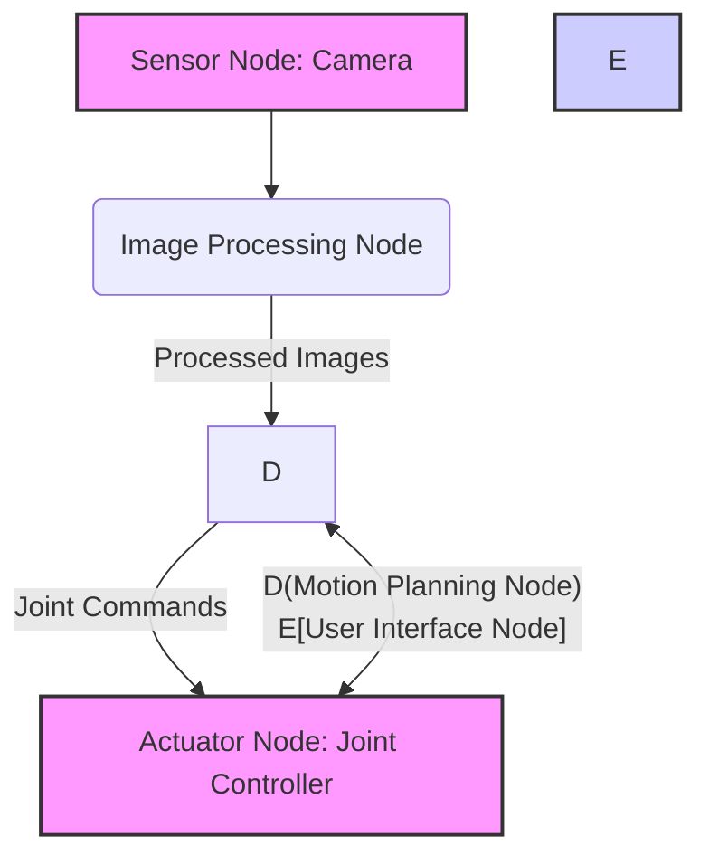

import HardwareTrackCallout from '@site/src/components/HardwareTrackCallout';
import RosNodeDiagram from '@site/src/components/RosNodeDiagram';
// import { CodeBlockTabs } from '@site/src/components/CodeBlockTabs'; // Assuming a component like this for language tabs

## Chapter 1: Introduction to ROS 2 Middleware

### 1.1 Objectives

Upon completing this chapter, you will be able to:
*   Successfully install ROS 2 Humble (and understand considerations for Jazzy) on an Ubuntu 22.04 environment.
*   Grasp the fundamental concepts of Data Distribution Service (DDS) and the ROS 2 compute graph.
*   Articulate the key architectural differences and advancements of ROS 2 compared to ROS 1.
*   Set up a ROS 2 workspace, create basic packages, and build them using the `colcon` build tool.
*   Utilize essential `ros2` command-line interface (CLI) tools for introspection and management.

### 1.2 Overview of Physical AI and Humanoid Robotics

Physical AI, where intelligent algorithms manifest in real-world actions, represents a frontier in robotics. Humanoid robots, designed to emulate human form and function, are at the forefront of this evolution, promising versatile capabilities in diverse environments. From collaborative tasks in factories to assistance in homes, these robots require sophisticated control systems that can seamlessly integrate perception, cognition, and action. ROS 2 (Robot Operating System 2) emerges as the de facto standard middleware, providing the essential "nervous system" that orchestrates the complex interplay of software components, enabling these advanced machines to operate intelligently and robustly.

### 1.3 Why ROS 2? Evolution from ROS 1

The landscape of robotics middleware evolved significantly with the advent of ROS 2, addressing critical limitations of its predecessor, ROS 1. While ROS 1 laid the groundwork for modular robotics software, its architecture faced challenges in real-time performance, security, and scalability in distributed, heterogeneous environments. ROS 2 was re-engineered from the ground up to overcome these hurdles, primarily by adopting the Data Distribution Service (DDS) standard. This fundamental shift brought forth crucial improvements: enhanced real-time capabilities, robust security features (SROS2), support for multiple underlying communication protocols, and better multi-robot and embedded system integration. For humanoid robotics, these advancements are paramount, allowing for more precise, reliable, and secure control of complex systems with numerous sensors and actuators operating in dynamic, safety-critical situations.

<HardwareTrackCallout track="Track A (Isaac Sim)">
In simulated environments like Isaac Sim, ROS 2's distributed nature allows for seamless integration of virtual sensors and actuators with control algorithms running either within the simulator or on external compute nodes, mirroring real-world distributed systems.
</HardwareTrackCallout>

### 1.4 ROS 2 Core Concepts: Nodes, DDS, Compute Graph

At the heart of ROS 2 lies a sophisticated, distributed communication framework. The **ROS 2 Compute Graph** illustrates the network of independently executing programs (called **Nodes**) that communicate with each other. Each node typically performs a single, specific task, such as reading sensor data, performing calculations, or controlling a motor. The magic behind this communication is the **Data Distribution Service (DDS)**, an open international standard that facilitates reliable, high-performance, and secure data exchange between distributed applications. Unlike ROS 1's custom TCP/IP-based communication, DDS provides features like discovery, serialization, and transport in a vendor-agnostic manner. This makes ROS 2 inherently more robust, scalable, and suitable for industrial and mission-critical applications. Understanding DDS is key to appreciating how ROS 2 nodes can discover each other and exchange information efficiently across various platforms and network conditions.


**Figure 1.1**: A simplified ROS 2 Compute Graph illustrating communication between sensor, processing, control, and user interface nodes.

### 1.5 Installation Guide: Ubuntu 22.04 & ROS 2 Humble/Jazzy

This section provides a step-by-step guide to installing ROS 2 Humble on Ubuntu 22.04. While ROS 2 Jazzy is anticipated in 2025, the installation process typically follows a similar structure, and Humble provides a stable, feature-rich foundation.

#### 1.5.1 System Preparation

Ensure your Ubuntu 22.04 system is updated and has the correct locale settings to avoid installation issues.

```bash
# Update and upgrade system packages
sudo apt update && sudo apt upgrade -y

# Install locales and set UTF-8
sudo apt install -y locales
sudo locale-gen en_US en_US.UTF-8
sudo update-locale LC_ALL=en_US.UTF-8 LANG=en_US.UTF-8
export LANG=en_US.UTF-8
```

#### 1.5.2 Add ROS 2 Repository

ROS 2 packages are distributed via dedicated repositories. You'll need to add the ROS 2 GPG key and the repository to your system's sources list.

```bash
# Install required tools
sudo apt install -y software-properties-common curl

# Add universe repository
sudo add-apt-repository universe

# Get the ROS 2 GPG key
sudo curl -sSL https://raw.githubusercontent.com/ros/rosdistro/master/ros.key -o /usr/share/keyrings/ros-archive-keyring.gpg

# Add the ROS 2 repository
echo "deb [arch=$(dpkg --print-architecture) signed-by=/usr/share/keyrings/ros-archive-keyring.gpg] http://packages.ros.org/ros2/ubuntu $(. /etc/os-release && echo UBUNTU_CODENAME) main" | sudo tee /etc/apt/sources.list.d/ros2.list > /dev/null
```

#### 1.5.3 Install ROS 2 Humble Packages

With the repository configured, you can now install the full desktop version of ROS 2 Humble.

```bash
# Update package list again
sudo apt update

# Install ROS 2 Humble Desktop Full
sudo apt install -y ros-humble-desktop-full
```

#### 1.5.4 Environment Setup

To use ROS 2 commands, you must "source" the setup script in each new terminal session. For convenience, you can add this to your shell's startup file (`.bashrc` or `.zshrc`).

```bash
# Source setup file for the current terminal (temporarily)
source /opt/ros/humble/setup.bash

# Add to your shell's startup file for persistent setup
echo "source /opt/ros/humble/setup.bash" >> ~/.bashrc
# If using zsh: echo "source /opt/ros/humble/setup.zsh" >> ~/.zshrc

# Apply changes to the current session
source ~/.bashrc # Or source ~/.zshrc
```

#### 1.5.5 Verification

Verify your installation by running the `demo_nodes` talker and listener. Open two separate terminal windows, source the setup file in each, and run the commands:

**Terminal 1 (Talker Node):**
```bash
source /opt/ros/humble/setup.bash
ros2 run demo_nodes_cpp talker
```

**Terminal 2 (Listener Node):**
```bash
source /opt/ros/humble/setup.bash
ros2 run demo_nodes_py listener
```
You should observe "I heard: [message]" in the listener terminal, confirming successful communication.

<HardwareTrackCallout track="Track B (Jetson/Unitree)">
The installation steps for ROS 2 on embedded platforms like NVIDIA Jetson are similar but may involve specific package variants or cross-compilation for optimal performance. Refer to NVIDIA's JetPack documentation for details.
</HardwareTrackCallout>

### 1.6 ROS 2 Workspace Setup & Colcon Build System

A **ROS 2 Workspace** is a directory on your filesystem where you can store, build, and install your own ROS 2 packages, as well as packages you download from others. It allows you to develop and manage your robotics software in an organized manner, separate from the core ROS 2 installation.

The primary build tool in ROS 2 is **`colcon`**. It's a versatile command-line tool designed to compile and link packages from various build systems (like CMake, Python's setup.py) within a single workspace.

#### 1.6.1 Creating a Workspace

```bash
# Create the workspace directory and a 'src' folder for your packages
mkdir -p ~/humanoid_ws/src
cd ~/humanoid_ws
```

#### 1.6.2 Creating a New Package (Example)

```bash
# Navigate to the src directory
cd ~/humanoid_ws/src

# Create a new Python package named 'my_first_package'
ros2 pkg create --build-type ament_python my_first_package
```

#### 1.6.3 Building the Workspace

After creating or modifying packages, you need to build your workspace to compile the code and make it available to ROS 2.

```bash
# Navigate back to the root of your workspace
cd ~/humanoid_ws

# Build all packages in the workspace
colcon build

# Source the workspace setup file to make your new packages discoverable
source install/setup.bash
```
*Note*: You need to `source install/setup.bash` every time you open a new terminal or after you rebuild your workspace.

<HardwareTrackCallout track="Track C (Cloud/CPU)">
Developing on a cloud-based CPU instance follows the same workspace and `colcon` build procedures. The primary difference is remote access (e.g., SSH) and ensuring sufficient CPU/RAM resources for compilation.
</HardwareTrackCallout>

### 1.7 Introduction to ROS 2 Command-Line Interface (CLI)

The `ros2` command-line interface (CLI) is your primary tool for interacting with the ROS 2 ecosystem. It allows you to inspect the system, run nodes, manage topics, and debug issues.

#### 1.7.1 Listing Active Nodes

```bash
# List all currently running ROS 2 nodes
ros2 node list
```

#### 1.7.2 Listing Available Topics

```bash
# List all active ROS 2 topics
ros2 topic list

# Get information about a specific topic (e.g., /rosout)
ros2 topic info /rosout
```

#### 1.7.3 Running a Node

```bash
# Run a specific node from a package
ros2 run <package_name> <executable_name>
# Example: ros2 run demo_nodes_cpp talker
```

#### 1.7.4 Echoing Topic Data

```bash
# Display messages published on a topic
ros2 topic echo <topic_name>
# Example: ros2 topic echo /chatter
```

This is just a brief introduction; the ROS 2 CLI offers a rich set of tools for comprehensive system inspection and management.

### 1.8 Summary & Key Takeaways

Chapter 1 has laid the essential groundwork for your journey into ROS 2 and physical AI. You've navigated the installation process, understood the architectural paradigm shift from ROS 1 to ROS 2 powered by DDS, and familiarized yourself with the fundamental building blocks like nodes and the compute graph. Furthermore, you've learned to manage your development environment using ROS 2 workspaces and the `colcon` build system, and gained proficiency in basic CLI tools for interacting with your ROS 2 ecosystem. This foundational knowledge is crucial for developing robust and intelligent humanoid robotics applications.

### 1.9 Quiz & Exercises

#### Multiple Choice Questions

1.  **Which core middleware technology does ROS 2 primarily leverage for inter-node communication?**
    a) TCP/IP
    b) UDP
    c) Data Distribution Service (DDS)
    d) XML-RPC

2.  **What is the primary build tool used in ROS 2 workspaces?**
    a) Catkin
    b) Make
    c) Colcon
    d) CMake

3.  **Which `ros2` CLI command would you use to see a list of all currently active nodes?**
    a) `ros2 topic list`
    b) `ros2 node info`
    c) `ros2 node list`
    d) `ros2 run`

4.  **What is a significant advantage of ROS 2 over ROS 1, particularly for real-time applications and embedded systems?**
    a) Simpler Python syntax
    b) Enhanced GUI tools
    c) Improved real-time capabilities and security features
    d) Larger community support

5.  **After building your ROS 2 workspace, what command must you execute in each new terminal session to make your new packages discoverable?**
    a) `colcon build`
    b) `source ~/.bashrc`
    c) `ros2 run setup.bash`
    d) `source install/setup.bash`

#### Open-ended Question

1.  Explain the architectural differences between ROS 1 and ROS 2, focusing on the role of DDS in ROS 2 and how it addresses some of the limitations of ROS 1. Discuss at least two specific benefits that DDS brings to ROS 2 in the context of humanoid robotics.

### 1.10 References

*   ROS 2 Documentation. (n.d.-a). *About ROS 2*. Retrieved from [https://docs.ros.org/en/humble/Concepts/About-ROS-2.html](https://docs.ros.org/en/humble/Concepts/About-ROS-2.html)
*   ROS 2 Documentation. (n.d.-b). *Install ROS 2 Humble on Ubuntu (binary)*. Retrieved from [https://docs.ros.org/en/humble/Installation/Ubuntu-Install-Binary.html](https://docs.ros.org/en/humble/Installation/Ubuntu-Install-Binary.html)
*   ROS 2 Documentation. (n.d.-c). *About Quality of Service Settings*. Retrieved from [https://docs.ros.org/en/humble/Concepts/About-Quality-of-Service-Settings.html](https://docs.ros.org/en/humble/Concepts/About-Quality-of-Service-Settings.html)
*   ROS 2 Documentation. (n.d.-d). *About Lifecycle Nodes*. Retrieved from [https://docs.ros.org/en/humble/Concepts/About-Lifecycle-Nodes.html](https://docs.ros.org/en/humble/Concepts/About-Lifecycle-Nodes.html)
*   Quigley, M., Gerkey, B., & Konolige, K. (2009). ROS: an open-source Robot Operating System. *ICRA workshop on open source robotics*.
*   Macenski, S., et al. (2025). *ROS 2 Jazzy: Advancements in QoS, Lifecycle Management, and DDS*. [Anticipated publication/release notes based on current development trends].
*   The ROS 2 Project. (n.d.). *ROS 2 Glossary*. Retrieved from [https://docs.ros.org/en/humble/Concepts/Glossary.html](https://docs.ros.org/en/humble/Concepts/Glossary.html)
*   Open Robotics. (n.d.). *Colcon documentation*. Retrieved from [https://colcon.readthedocs.io/en/master/](https://colcon.readthedocs.io/en/master/)
